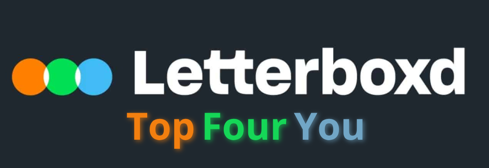
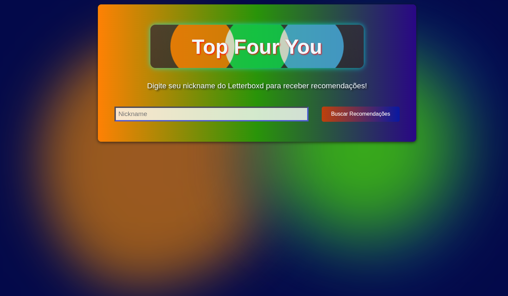

# 🎥 TopFourYou ( Projeto em andamento)

  TopFourYou é um sistema de recomendação de filmes que utiliza os quatro filmes favoritos de um usuário no Letterboxd como base para entender seu gosto cinematográfico. Através da análise de embeddings semânticos gerados a partir de metadados dos filmes e um algoritmo avançado de ranqueamento (MMR), o sistema sugere de forma inteligente novos filmes que se alinham com a identidade cinematográfica única do usuário, balanceando relevância e diversidade.

## ✨ Funcionalidades Principais 

- Recomendações Personalizadas: Gera uma lista de filmes a partir de um simples nickname do Letterboxd.

- Web Scraping Dinâmico: Utiliza Selenium para buscar em tempo real os 4 filmes favoritos do perfil do usuário.

- Correspondência Inteligente de Títulos: Emprega fuzzy matching (rapidfuzz) para encontrar correspondências precisas no banco de dados, mesmo com pequenas variações nos títulos.

- Perfil de Usuário Vetorial: Cria um "vetor de gosto" para o usuário, calculando a média ponderada dos embeddings dos seus filmes favoritos.

- Busca Eficiente de Candidatos: Usa FAISS (Facebook AI Similarity Search) para encontrar rapidamente um conjunto de filmes candidatos que são semanticamente similares ao perfil do usuário.

- Ranqueamento Avançado (MMR): Implementa o algoritmo Maximal Marginal Relevance (MMR) para refinar a lista de candidatos, garantindo que as recomendações não sejam apenas relevantes, mas também diversificadas e interessantes.

- Interface Web Interativa: Frontend simples e responsivo construído com Flask, HTML, CSS e JavaScript.

## ⚙️ Como Funciona

O fluxo de recomendação é orquestrado em várias etapas para garantir alta qualidade e performance:

- Entrada do Usuário: O usuário insere seu nickname do Letterboxd na interface web.

- Coleta de Dados (Scraping): O backend aciona um scraper com Selenium que navega até o perfil do Letterboxd e extrai os títulos dos quatro primeiros filmes da lista de "Favorites".

- Correspondência (Matching): Os títulos extraídos são comparados com a base de dados interna usando rapidfuzz. Isso resolve inconsistências como "The Dark Knight (2008)" vs. "The Dark Knight".

- Criação do Perfil de Usuário: O sistema recupera os vetores de embedding (gerados previamente com Sentence-Transformers) para cada filme correspondido. Esses vetores representam numericamente o conteúdo e o estilo de cada filme. Em seguida, um "vetor de gosto" médio é calculado para representar o perfil do usuário.

- Relevância: Quão similar o filme é ao perfil do usuário.

- Diversidade: Quão diferente o filme é dos filmes já selecionados para a lista de recomendação.

Isso evita que o sistema recomende 10 filmes do mesmo diretor ou subgênero, resultando em uma lista mais rica e útil.

- Exibição dos Resultados: A lista final, ordenada por nota do IMDb, é enviada para o frontend e exibida ao usuário.

## 🛠️ Stack de Tecnologias
    Backend: Flask, Gunicorn

    Frontend: HTML5, CSS3, JavaScript

    Web Scraping: Selenium, BeautifulSoup4

    Machine Learning / Data Science:

    Pandas & NumPy: Manipulação de dados.

    Sentence-Transformers: Geração de embeddings de texto.

    Faiss (Facebook AI): Busca de similaridade em vetores de alta dimensão.

    Scikit-learn: Para cosine_similarity.

    RapidFuzz: Para correspondência de strings.

## 🚀 Instalação e Execução

 


Para rodar este projeto localmente, siga os passos abaixo.

Pré-requisitos:

      Python 3.8+
    
      Google Chrome instalado

      ChromeDriver (compatível com sua versão do Google Chrome) adicionado ao seu PATH do sistema.

Passos:

- Clone o repositório:
  
```
git clone https://github.com/seu-usuario/TopFourYou.git
cd TopFourYou
```

- Crie e ative um ambiente virtual:

```
python -m venv venv
# No Windows
venv\Scripts\activate
# No macOS/Linux
source venv/bin/activate
```

- Instale as dependências:

requirements.txt ou manualmente:

- flask
- flask-cors
- pandas
- numpy
- selenium
- beautifulsoup4
- rapidfuzz
- scikit-learn
- faiss-cpu
- sentence-transformers
- tqdm
- gunicorn

```
pip install -r requirements.txt
```

- Estrutura de Dados:

  **Certifique-se de ter o arquivo do seu dataset em ./data/pre-processing/base_transformada.csv.**

- Na primeira execução, o sistema irá gerar e salvar os embeddings em ./data/embeddings/movie_embeddings.npy.

Execute a aplicação Flask:
```
python app.py
```

- Abra seu navegador e acesse http://127.0.0.1:5000.

## 🔮 Funcionalidades Futuras

[ ] Permitir ao usuário escolher o serviço de streaming (Netflix, Prime Video, etc.) para filtrar as recomendações.

[ ] Exibir o pôster oficial de cada filme recomendado.

[ ] Permitir que o usuário ajuste o parâmetro de "diversidade vs. relevância" (lambda do MMR) diretamente na interface.

[ ] Adicionar um sistema de cache para nicknames já pesquisados, a fim de acelerar futuras buscas.
